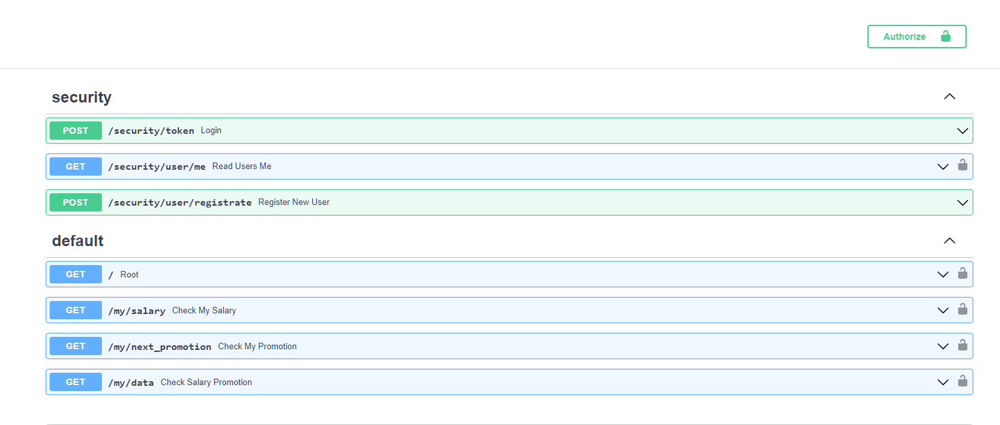

# FastAPI_For_Shift

# Описание использованных технологий
* Соединение с базой данных реализовано асинхронно через "postgresql+asyncpg"
------
* Для обеспечения авторизации используется OAuth2PasswordBearer,\
  при авторизации пользователь отправляет свой логин и пароль, \
  на основе которого сервер генерирует jwt токен для дальнейшей работы.
* jwt токен генерируется на основе секретного ключа и алгоритма, которые указывается\
  в файлах конфигурации
* Пароль хранится в БД в виде хеша, который мы получаем с помощью библиотеки <strong>passlib</strong>

## Getting started

1)После установки необходимо указать виртуальное окружение poetry

2)Убедиться что все работает использовав команды

```
poetry install
poetry show
```
3)Необходимо создать файл окружения ".env"
и занести в него файлы конфигурации для подключения бд и генерации jwt токена:
пример заполнения 
```
# PostgreSQL
POSTGRES_USER=user
POSTGRES_PASSWORD=password
POSTGRES_SERVER=localhost
POSTGRES_DB=forFastapi


# security token
SECRET_KEY = "secretkey"
ALGORITHM = "HS256"
ACCESS_TOKEN_EXPIRE_MINUTES = 30
```

4)Далее запускаем сервер unicorn

```
 uvicorn main:app --reload
```
5)проходим по адресу http://127.0.0.1:8000/docs,
что бы ознакомиться с автоматически сгенерированной api документацией


## Пользуйтесь

Представлен ряд методов

1) не требуют авторизации: создание пользователя, авторизация
2) требуют авторизации: всё остальное - получения информации о зарплате и преспективном 
повышение сотрудника

